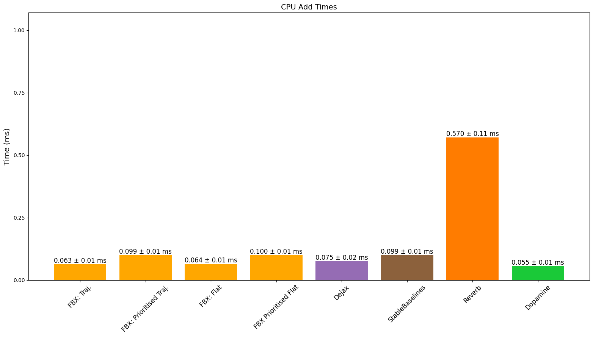
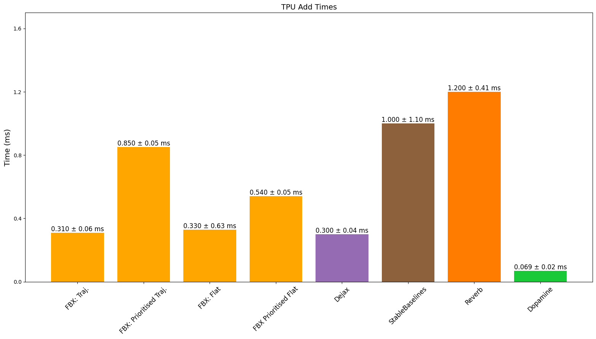
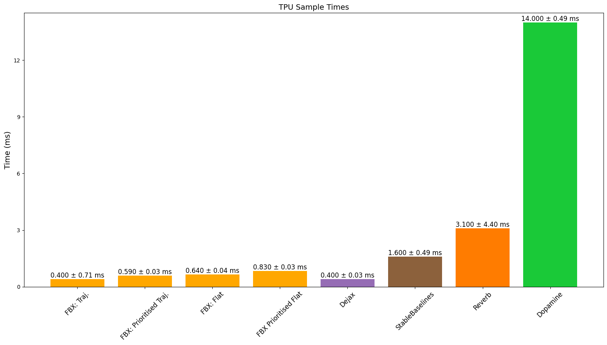
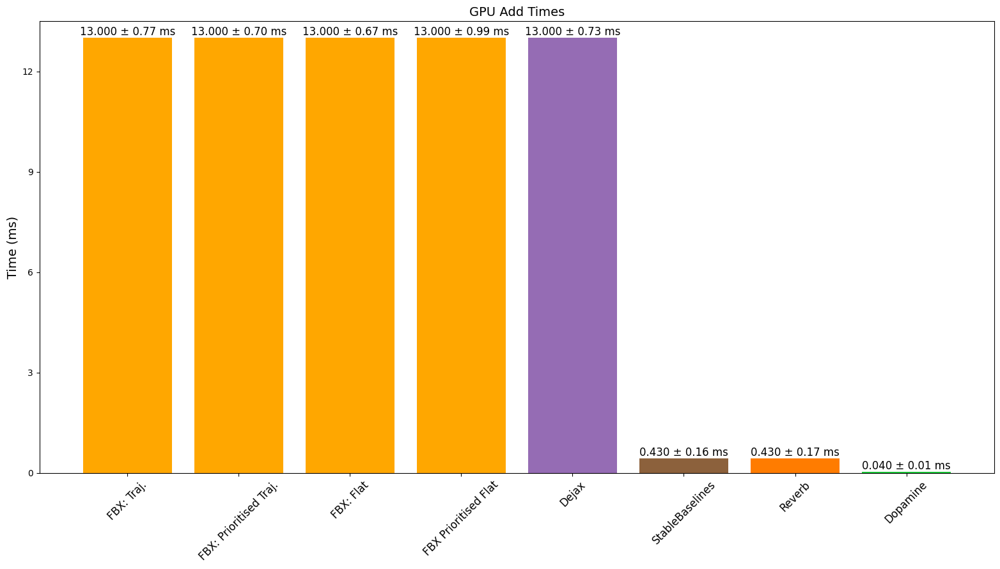
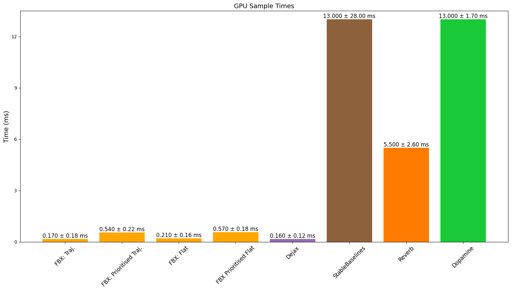
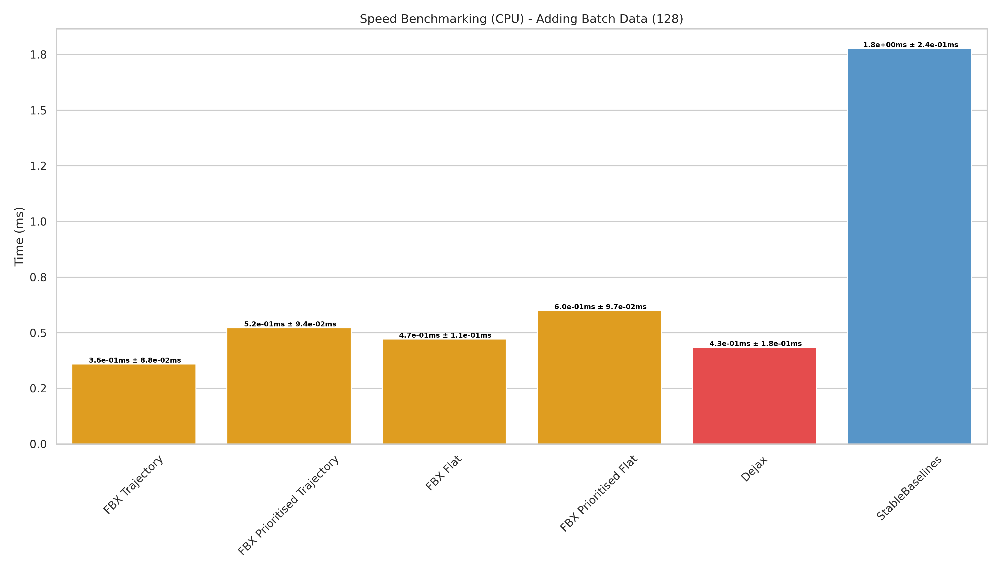
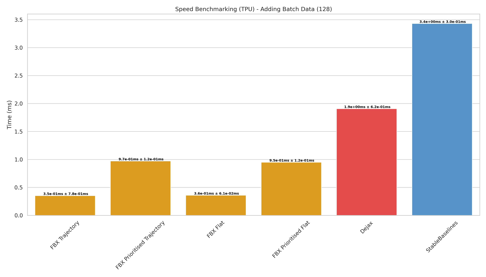
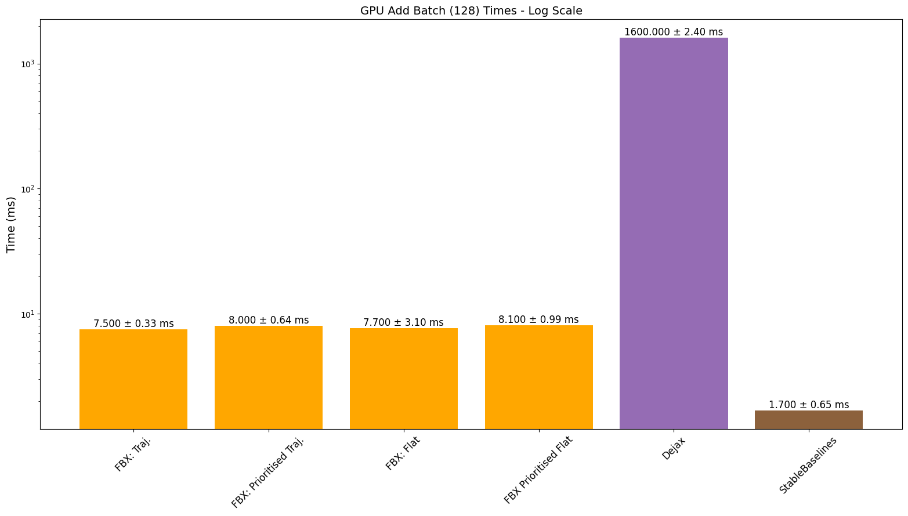

<p align="center">
    <a href="./docs/img/logo.png#gh-light-mode-only">
        
    </a>
    <a href="./docs/img/logo_dm.png#gh-dark-mode-only">
        
    </a>
</p>

[](https://www.python.org/doc/versions/)
[](https://badge.fury.io/py/flashbax)
[](https://github.com/instadeepai/flashbax/actions/workflows/tests_linters.yml)
[](https://github.com/psf/black)
[](http://mypy-lang.org/)
[](https://opensource.org/licenses/Apache-2.0)

<div align="center">
    <h3>
      <a href="#overview-">Overview</a> |
      <a href="#features-%EF%B8%8F">Features</a> |
      <a href="#setup-">Setup</a> |
      <a href="#quickstart-">Quick Start</a> |
      <a href="#examples-">Examples</a> |
      <a href="#important-considerations-%EF%B8%8F">Important Considerations</a> |
      <a href="#benchmarks-">Benchmarks</a> |
      <a href="#contributing-">Contributing</a> |
      <a href="#see-also-">See Also</a> |
      <a href="#citing">Citing</a> |
      <a href="#acknowledgements-">Acknowledgments</a>
    </h3>
</div>


---

# ⚡ High Speed Buffers In Jax ⚡

## Overview 🔍

Flashbax is a library designed to streamline the use of experience replay buffers within the context of reinforcement learning (RL). Tailored specifically for compatibility with the JAX paradigm, Flashbax allows these buffers to be easily utilised within fully compiled functions and training loops.

Flashbax provides an implementation of various different types of buffers, such as Flat Buffer, Trajectory Buffer, and Prioritised variants of both. Whether for academic research, industrial applications, or personal projects, Flashbax offers a simple and flexible framework for RL experience replay handling.

## Features 🛠️

🚀 **Efficient Buffer Variants**: All Flashbax buffers are built as specialised variants of the trajectory buffer, optimising memory usage and functionality across various types of buffers.

🗄️ **Flat Buffer**: The Flat Buffer, akin to the transition buffer used in algorithms like DQN, is a core component. It employs a sequence of 2 (i.e. $s_t$, $s_{t+1}$), with a period of 1 for comprehensive transition pair consideration.

🧺 **Item Buffer**: The Item Buffer is a simple buffer that stores individual items. It is useful for storing data that is independent of each other, such as (observation, action, reward, discount, next_observation) tuples, or entire episodes.

🛤️ **Trajectory Buffer**: The Trajectory Buffer facilitates the sampling of multi-step trajectories, catering to algorithms utilising recurrent networks like R2D2 (Kapturowski et al., [2018](https://www.deepmind.com/publications/recurrent-experience-replay-in-distributed-reinforcement-learning)).

🏅 **Prioritised Buffers**: Both Flat and Trajectory Buffers can be prioritised, enabling sampling based on user-defined priorities. The prioritisation mechanism aligns with the principles outlined in the PER paper (Schaul et al, [2016](https://arxiv.org/abs/1511.05952)).

🚶 **Trajectory/Flat Queue**: A queue data structure is provided where one is expected to sample data in a FIFO order. The queue can be used for on-policy algorithms with specific use cases.

## Setup 🎬

To integrate Flashbax into your project, follow these steps:

1. **Installation**: Begin by installing Flashbax using `pip`:
```bash
pip install flashbax
```

2. **Selecting Buffers**: Choose from a range of buffer options, including Flat Buffer, Trajectory Buffer, and Prioritised variants.
```python
import flashbax as fbx

buffer = fbx.make_trajectory_buffer(...)
# OR
buffer = fbx.make_prioritised_trajectory_buffer(...)
# OR
buffer = fbx.make_flat_buffer(...)
# OR
buffer = fbx.make_prioritised_flat_buffer(...)
# OR
buffer = fbx.make_item_buffer(...)
# OR
buffer = fbx.make_trajectory_queue(...)

# Initialise
state = buffer.init(example_timestep)
# Add Data
state = buffer.add(state, example_data)
# Sample Data
batch = buffer.sample(state, rng_key)
```

## Quickstart 🏁

Below we provide a minimal code example for using the flat buffer. In this example, we show how each of the pure functions defining the flat buffer may be used. We note that each of these pure functions is compatible with `jax.pmap` and `jax.jit`, but for simplicity, these are not used in the below example.

```python
import jax
import jax.numpy as jnp
import flashbax as fbx

# Instantiate the flat buffer NamedTuple using `make_flat_buffer` using a simple configuration.
# The returned `buffer` is simply a container for the pure functions needed for using a flat buffer.
buffer = fbx.make_flat_buffer(max_length=32, min_length=2, sample_batch_size=1)

# Initialise the buffer's state.
fake_timestep = {"obs": jnp.array([0, 0]), "reward": jnp.array(0.0)}
state = buffer.init(fake_timestep)

# Now we add data to the buffer.
state = buffer.add(state, {"obs": jnp.array([1, 2]), "reward": jnp.array(3.0)})
print(buffer.can_sample(state))  # False because min_length not reached yet.

state = buffer.add(state, {"obs": jnp.array([4, 5]), "reward": jnp.array(6.0)})
print(buffer.can_sample(state))  # Still False because we need 2 *transitions* (i.e. 3 timesteps).

state = buffer.add(state, {"obs": jnp.array([7, 8]), "reward": jnp.array(9.0)})
print(buffer.can_sample(state))  # True! We have 2 transitions (3 timesteps).

# Get a transition from the buffer.
rng_key = jax.random.PRNGKey(0)  # Source of randomness.
batch = buffer.sample(state, rng_key)  # Sample

# We have a transition! Prints: obs = [[4 5]], obs' = [[7 8]]
print(
    f"obs = {batch.experience.first['obs']}, obs' = {batch.experience.second['obs']}"
)
```

## Examples 🧑‍💻

We provide the following Colab examples for a more advanced tutorial on how to use each of the flashbax buffers as well as usage examples:

| Colab Notebook | Description |
|----------------|-------------|
| [](https://colab.research.google.com/github/instadeepai/flashbax/blob/main/examples/quickstart_flat_buffer.ipynb) | Flat Buffer Quickstart|
| [](https://colab.research.google.com/github/instadeepai/flashbax/blob/main/examples/quickstart_trajectory_buffer.ipynb) | Trajectory Buffer Quickstart|
| [](https://colab.research.google.com/github/instadeepai/flashbax/blob/main/examples/quickstart_prioritised_flat_buffer.ipynb) | Prioritised Flat Buffer Quickstart|
| [](https://colab.research.google.com/github/instadeepai/flashbax/blob/main/examples/matrax_iql_example.ipynb) | Item Buffer Example with Matrax |
| [](https://colab.research.google.com/github/instadeepai/flashbax/blob/main/examples/anakin_dqn_example.ipynb) | Anakin DQN |
| [](https://colab.research.google.com/github/instadeepai/flashbax/blob/main/examples/anakin_prioritised_dqn_example.ipynb) | Anakin Prioritised DQN |
| [](https://colab.research.google.com/github/instadeepai/flashbax/blob/main/examples/anakin_ppo_example.ipynb) | Anakin PPO |
| [](https://colab.research.google.com/github/instadeepai/flashbax/blob/main/examples/gym_dqn_example.ipynb) | DQN with Vectorised Gym Environments |

- 👾 [Anakin](https://arxiv.org/abs/2104.06272) - JAX based architecture for jit compiling the training
of RL agents end-to-end.
- 🎮 [DQN](https://github.com/vwxyzjn/cleanrl/blob/master/cleanrl/dqn_jax.py) - implementation adapted
from CleanRLs DQN JAX example.
- 🦎 [Jumanji](https://github.com/instadeepai/jumanji/) - utilise Jumanji's JAX based environments
like Snake for our fully jitted examples.
- ✖️ [Matrax](https://github.com/instadeepai/matrax/) - two-player matrix games in JAX.

## Vault 💾
Vault is an efficient mechanism for saving Flashbax buffers to persistent data storage, e.g. for use in offline reinforcement learning. Consider a Flashbax buffer which has experience data of dimensionality $(B, T, \*E)$, where $B$ is a batch dimension (for the sake of recording independent trajectories synchronously), $T$ is a temporal/sequential dimension, and $\*E$ indicates the one or more dimensions of the experience data itself. Since large quantities of data may be generated for a given environment, Vault extends the $T$ dimension to a virtually unconstrained degree by reading and writing slices of buffers along this temporal axis. In doing so, gigantic buffer stores can reside on disk, from which sub-buffers can be loaded into RAM/VRAM for efficient offline training. Vault has been tested with the item, flat, and trajectory buffers.

For more information, see the demonstrative notebook: [](https://colab.research.google.com/github/instadeepai/flashbax/blob/main/examples/vault_demonstration.ipynb)


## Important Considerations ⚠️

When working with Flashbax buffers, it's crucial to be mindful of certain considerations to ensure the proper functionality of your RL agent.

### Sequential Data Addition
Flashbax uses a trajectory buffer as the foundation for all buffer types. This means that data must be added sequentially. Specifically, for the flat buffer, each added timestep must be followed by its consecutive timestep. In most scenarios, this requirement is naturally satisfied and doesn't demand extensive consideration. However, it's essential to be aware of this constraint, especially when adding batches of data that are completely independent of each other. Failing to maintain the sequence relationship between timesteps can lead to algorithmic issues. The user is expected to handle the case of final to first timestep. This happens when going from episode `n` to episode `n+1` in the same batch. For example, we utilise auto reset wrappers to automatically reset the environment upon a terminal timestep. Additionally, we utilise discount values (1 for non-terminal state, 0 for terminal state) to mask the value function and discounting of rewards accordingly.

### Effective Buffer Size
When adding batches of data, the buffer is created in a block-like structure. This means that the effective buffer size is dependent on the size of the batch dimension. The trajectory buffer allows a user to specify the add batch dimension and the max length of the time axis. This will create a block structure of (batch, time) allowing the maximum number of timesteps that can be in storage to be batch*time. For ease of use, we provide the max size argument that allows a user to set their total desired number of timesteps and we calculate the max length of the time axis dependent on the add batch dimension that is provided. Due to this, it is important to note that when using the max size argument, the max length of the time axis will be equal to max size // add batch size which will round down thereby reducing the effective buffer size. This means one might think they are increasing the buffer size by a certain amount but in actuality there is no increase. Therefore, to avoid this, we recommend one of two things: Use the max length time axis argument explicitly or increase the max size argument in multiples of the add batch size.

### Handling Episode Truncation
Another critical aspect is episode truncation. When truncating episodes and adding data to the buffer, it's vital to ensure that you set a done flag or a 'discount' value appropriately. Neglecting to do so can introduce challenges into your algorithm's implementation and behavior. As stated previously, it is expected that the algorithm handles these cases appropriately. It can be difficult handling truncation when using the flat buffer or trajectory buffer as the algorithm must handle the case of the final timestep in an episode being followed by the first timestep in the next episode. Sacrificing memory efficiency for ease of use, the item buffer can be used to store transitions or entire trajectories independently. This means that the algorithm does not need to handle the case of the final timestep in an episode being followed by the first timestep in the next episode as only the data that is explicitly inserted can be sampled.

### Independent Data Usage
For situations where you intend to utilise buffers with data that lack sequential information, you can leverage the item buffer which is a wrapped trajectory buffer with specific configurations. By setting a sequence dimension of 1 and a period of 1, each item will be treated as independent. However, when working with independent transition items like (observation, action, reward, discount, next_observation), be mindful that this approach will result in duplicate observations within the buffer, leading to unnecessary memory consumption. It is important to note that the implementation of the flat buffer will be slower than utilising the item buffer in this way due to the inherent speed issues that arise with data indexing on hardware accelerators; however, this trade-off is done to enhance memory efficiency. If speed is largely preferred over memory efficiency then use the trajectory buffer with sequence 1 and period 1 storing full transition data items.

### In-place Updating of Buffer State
Since buffers are generally large and occupy a significant portion of device memory, it is beneficial to perform in-place updates. To do this, it is important to specify to the top-level compiled function that you would like to perform this in-place update operation. This is indicated as follows:


```python
def train(train_state, buffer_state):
    ...
    return train_state, buffer_state

# Initialise the buffer state
buffer_fn = fbx.make_trajectory_buffer(...)
buffer_state = buffer_fn.init(example_timestep)

# Initialise some training state
train_state = train_state.init(...)

# Compile the training function and specify the donation of the buffer state argument
train_state, buffer_state = jax.jit(train, donate_argnums=(1,))(
    train_state, buffer_state
)
```

It is important to include `donate_argnums` when calling `jax.jit` to enable JAX to perform an in-place update of the replay buffer state. Omitting `donate_argnums` would force JAX to create a copy of the state for any modifications to the replay buffer state, potentially negating all performance benefits. More information about buffer donation in JAX can be found in the [documentation](https://jax.readthedocs.io/en/latest/faq.html#buffer-donation).


### Storing Data with Vault
As mentioned above, Vault stores experience data to disk by extending the temporal axis of a Flashbax buffer state. By default, Vault conveniently handles the bookkeeping of this process: consuming a buffer state and saving any fresh, previously unseen data. e.g. Suppose we write 10 timesteps to our Flashbax buffer, and then save this state to a Vault; since all of this data is fresh, all of it will be written to disk. However, if we then write one more timestep and save the state to the Vault, only that new timestep will be written, preventing any duplication of data that has already been saved. Importantly, one must remember that Flashbax states are implemented as _ring buffers_, meaning the Vault must be updated sufficiently frequently before unseen data in the Flashbax buffer state is overwritten. i.e. If our buffer state has a time-axis length of $\tau$, then we must save to the vault every $\tau - 1$ steps, lest we overwrite (and lose) unsaved data.

In summary, understanding and addressing these considerations will help you navigate potential pitfalls and ensure the effectiveness of your reinforcement learning strategies while utilising Flashbax buffers.

## Benchmarks 📈

Here we provide a series of initial benchmarks outlining the performance of the various Flashbax buffers compared against commonly used open-source buffers. In these benchmarks we (unless explicitly stated otherwise) use the following configuration:

| Parameter               | Value       |
|-------------------------|-------------|
| Buffer Size             | 500_000     |
| Sample Batch Size       | 256         |
| Observation Size        | (32, 32, 3) |
| Add Sequence Length     | 1           |
| Add Sequence Batch Size | 1           |
| Sample Sequence Length  | 1           |
| Sample Sequence Period  | 1           |

The reason we use a sample sequence length and period of 1 is to directly compare to the other buffers, this means the speeds for the trajectory buffer are comparable to the speeds of the item buffer as the item buffer is simply a wrapped trajectory buffer with this configuration. This essentially means that the trajectory buffers are being used as memory inefficent transition buffers. It is important to note that the Flat Buffer implementations use a sample sequence length of 2. Additionally, one must bear in mind that not all other buffer implementations can efficiently make use of GPUs/TPUs thus they simply run on the CPU and perform device conversions. Lastly, we explicitly make use of python loops to fairly compare to the other buffers. Speeds can be largely improved using scan operations (depending on observation size).

### CPU Speeds

<p float="left">


</p>

### TPU Speeds
<p float="left">


</p>

### GPU Speeds

We notice strange behaviour with the GPU speeds when adding data. We believe this is due to the fact that certain JAX operations are not yet fully optimised for GPU usage as we see Dejax has the same performance issues. We expect these speeds to improve in the future.

<p float="left">


</p>

### CPU, GPU, & TPU Adding Batches
Previous benchmarks added only a single timestep at a time, we now evaluate adding batches of 128 timesteps at a time - a feature that most would use in high-throughput RL. We only compare to the buffers which have this capability.

<p float="left">


</p>

<p align="center">

</p>

Ultimately, we see improved or comparable performance to benchmarked buffers whilst providing buffers that are fully JAX-compatible in addition to other features such as batched adding as well as being able to add sequences of varying length. We do note that due to JAX having different XLA backends for CPU, GPU, and TPU, the performance of the buffers can vary depending on the device and the specific operation being called.


## Contributing 🤝

Contributions are welcome! See our issue tracker for
[good first issues](https://github.com/instadeepai/flashbax/labels/good%20first%20issue). Please read
our [contributing guidelines](https://github.com/instadeepai/flashbax/blob/main/CONTRIBUTING.md) for
details on how to submit pull requests, our Contributor License Agreement, and community guidelines.

## See Also 📚
Checkout some of the other buffer libraries from the community that we have highlighted in our
benchmarks.

- 📀 [Dejax](https://github.com/hr0nix/dejax): the first library to provide a JAX-compatible replay buffers.
- 🎶 [Reverb](https://github.com/google-deepmind/reverb): efficient replay buffers used for both local and large-scale distributed RL.
- 🍰 [Dopamine](https://github.com/google/dopamine/blob/master/dopamine/replay_memory/): research framework for fast prototyping, providing several core replay buffers.
- 🤖 [StableBaselines3](https://stable-baselines3.readthedocs.io/en/master/): suite of reliable RL baselines with its own, easy-to-use replay buffers.

## Citing Flashbax ✏️

If you use Flashbax in your work, please cite the library using:

```
@misc{flashbax,
    title={Flashbax: Streamlining Experience Replay Buffers for Reinforcement Learning with JAX},
    author={Edan Toledo and Laurence Midgley and Donal Byrne and Callum Rhys Tilbury and
    Matthew Macfarlane and Cyprien Courtot and Alexandre Laterre},
    year={2023},
    url={https://github.com/instadeepai/flashbax/},
}
```

## Acknowledgements 🙏

The development of this library was supported with Cloud TPUs
from Google's [TPU Research Cloud](https://sites.research.google/trc/about/) (TRC) 🌤.
